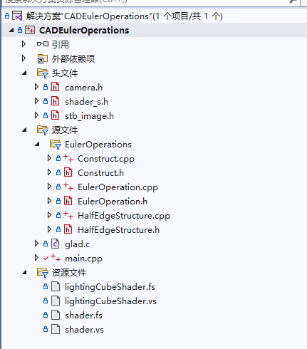
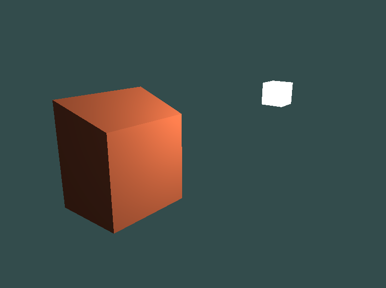
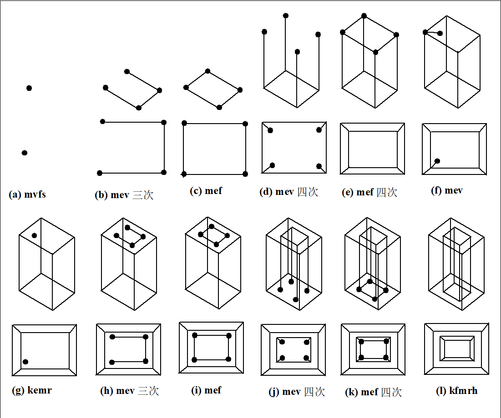
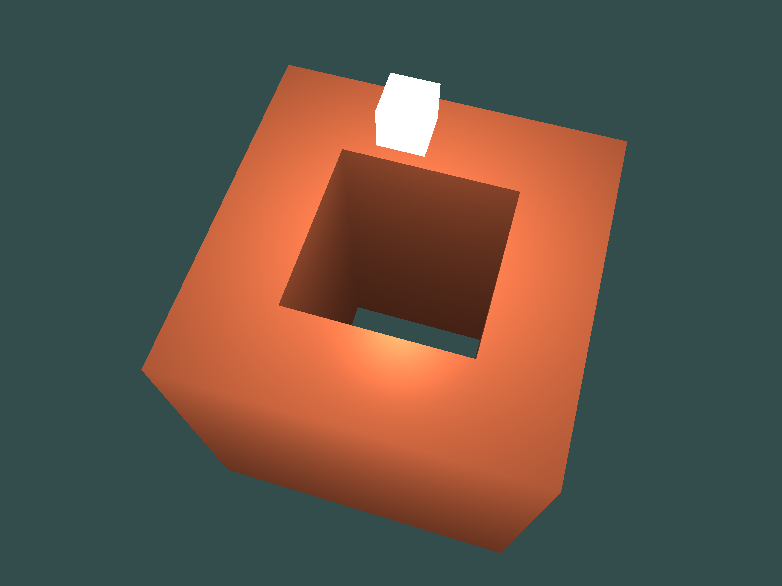
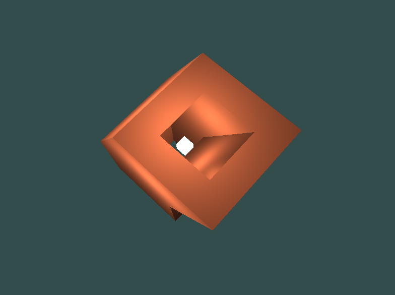

# 三维CAD建模 程序作业

## 程序使用说明

- 程序的Github页面：https://github.com/tml104/CADEulerOperations
- 运行环境： Visual Studio 2022, C++ 17
- 外部依赖项：（打开PropertSheet以编辑依赖路径，版本要求同https://learnopengl-cn.github.io/）
    - glfw
    - glad
    - glm-0.9.9.8
- 操作说明
  - 使用Visual Studio 2022（或者项目的./x64/Debug中）启动CADEulerOperations.exe
  - 程序启动后，输入1、2、3选择要调用的测试建模函数（请见下文“测试结果”查看具体说明）
  - 使用鼠标、键盘WASD在场景中移动
  - 使用上下箭头上下移动光源，使用键盘IJKL平移光源

## 程序结构说明

- main.cpp：提供渲染框架，启动渲染线程并进行着色。
- camera.h：摄像机类
- shader_s.h：着色器管理类
- stb_image.h：（没有使用）读取贴图的函数库
- EulerOperations:
  - HalfEdgeStructure.h, HalfEdgeStructure.cpp: 半边数据结构的实现
  - EulerOperation.h, EulerOperation.cpp： 5种欧拉操作以及扫掠sweep操作。
  - Construct.h, Construct.cpp: 定义建模操作函数，以及将模型操作转换为离散顶点用以输出
- 着色器文件：使用Phong着色算法对所建模物体进行真实感着色。
  - 建模物体的顶点、片段着色器：shader.vs, shader.fs
  - 光源方块的顶点、片段着色器: lightingCubeShader.vs, lightingCubeShader.fs

## 测试结果

Construct::test1：其调用mvfs、mev和mef操作创建面，并使用sweep扫掠操作向(1,1,1)方向进行扫掠，创建一个经过错切变换的立方体。

Construct::test2：其通过5种欧拉操作构造带孔立方体。

Construct::test3：在2的基础上，对顶部带环面进行扫掠，得到一个烟囱体。证明代码可以对带环面进行扫掠。

